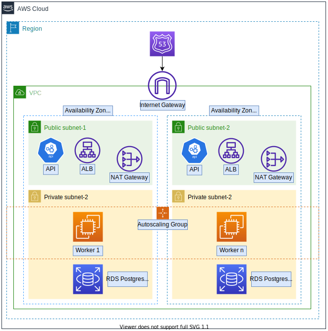

# **Kubernetes Deployment of Notejam application on AWS EKS with Terraform**
Notejam flask application with postgres DB on RDS. Kubernetes Deployment on AWS EKS by provisioning with Terraform. Github Actions to build docker images to be pushed to AWS ECR.

## Architecture:


## Prerequisities:
- [Docker](https://www.digitalocean.com/community/tutorials/how-to-install-and-use-docker-on-ubuntu-20-04) & [Docker-compose](https://docs.docker.com/compose/install/)
- [AWS client Setup](https://docs.aws.amazon.com/cli/latest/userguide/cli-chap-configure.html)
- [Terraform]((https://www.terraform.io/downloads.html))
- [Kubectl](https://kubernetes.io/docs/tasks/tools/install-kubectl-linux/)
- [Eksctl](https://docs.aws.amazon.com/eks/latest/userguide/eksctl.html)
- [Helm](https://helm.sh/docs/intro/install/)


## Steps
1. Update terraform.tfvars with your own config variables and ssh-key. When ready, initiate terraform:
```
terraform -chdir=terraform init
```
2. Make all the scripts executable:
```
find . -maxdepth 1 -type f -name "*.sh" -exec chmod +x {} \;
```  
3. Create AWS Secret for DB Credentials: `./1_create_db_creds.sh`
4. Create Route 53 DNS Zone if not exists: `./2_route53.sh`
5. Provision AWS with terraform:
```
terraform -chdir=terraform apply
```
- There is a bastion server provisioned as well to login to EKS worker nodes through private network. Login with your ssh-key that you've created:
```
ssh -i "ssh-key" ubuntu@$(terraform -chdir=terraform output -raw bastion_public_ip)
```
6. Kubectl config setup: `./3_EKS_setup.sh`
- Check that you are able to connect to k8s cluster:
```
kubectl get nodes
```
- Check your access to RDS
```
# Note the db_endpoint and port
terraform -chdir=terraform output db_endpoint

# Run a temporary busybox pod
kubectl run -it --rm busybox --image=busybox --restart=Never -- sh

# Check if you can connect to db_endpoint instance with telnet
telnet db_endpoint port
```
7. Login to AWS ECR service:
```
aws ecr get-login-password --region $(terraform -chdir=terraform output -raw aws_region) \
| docker login --username AWS --password-stdin $(terraform -chdir=terraform output -raw registry_backend)
```
8. Associate EKS cluster with OpenID Connect Provider ([Guide](https://docs.aws.amazon.com/eks/latest/userguide/enable-iam-roles-for-service-accounts.html)): `./4_OIDC_associate.sh`
9. Install cert-manager ([Guide](https://cert-manager.io/)) `./5_cert_manager.sh`
- make sure that pods are in Running state: `kubectl -n cert-manager get pods`
10. Install Load Balancer Controller ([Guide](https://kubernetes-sigs.github.io/aws-load-balancer-controller/v2.3/deploy/installation/)): `./6_LB_controller.sh`
11. Create cert-manager cluster issuer ([Guide](https://cert-manager.io/docs/configuration/acme/dns01/route53/)): `./7_cluster_issuer.sh`
12. Create Namespaces: `kubectl apply -f k8s/namespaces.yaml`
13. Create Secrets for Postgres Credentials (Alternatively, a more robust and secure solution would be to use AWS Secrets Manager service &rarr; [Guide](https://docs.aws.amazon.com/secretsmanager/latest/userguide/integrating_csi_driver.html)): `./8_k8s_secrets.sh` 
- This will be created under 'staging' namespace since I will be deploying the application under this namespace. This should be modified to be used in a CI/CD system.
14. Github actions will build a notejam image and push to AWS ECR after each git push to master branch.
- Run `deploy_k8s.sh` to create a deployment and expose it with a k8s service. 


